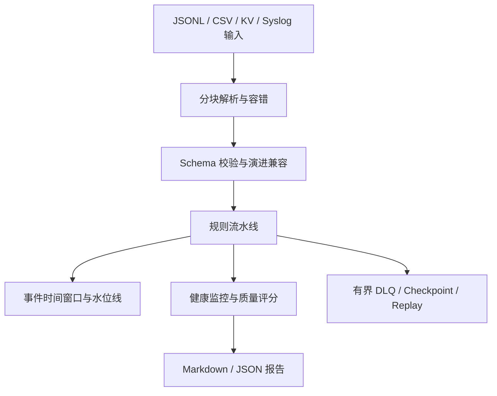

# MoonBit 8 月黑客松项目申报书

## 一、项目基本信息

| 项目信息项 | 项目具体内容 |
| :--- | :--- |
| 项目名称 | MoonBit 流式数据质量规则引擎 (`moon-stream-quality`) |
| 项目类别 | 工具链与基础软件 / 实时数据流处理组件 |
| 申报人/唯一贡献者 | `zmjknn` |
| 参赛组别 | MoonBit 官方 8 月黑客松（August Hackathon） |
| 项目开源地址 | https://github.com/zmjknn/moon-stream-quality |
| 开发语言 | MoonBit，WASM 优先 |
| 开源许可证 | Apache License 2.0 |

## 二、项目背景与目标

金融交易、IoT 传感器和系统日志在进入数仓、告警系统或模型前，需要低延迟地识别缺失、类型错误、重复、乱序和异常值。传统批处理工具难以表达事件时间水位线、迟到事件、断流饥饿和突发流量等在线质量信号；动态 JSON 校验也容易把错误推迟到运行时。

本项目的目标是交付一个无外部运行时依赖、可编译为 WASM 的 MoonBit 原生质量引擎：输入可恢复，规则可组合，状态有界，失败可审计和重放，指标可复测。

## 三、技术方案与本次结项实现



已实现的核心路径：

1. `src/core`：事件模型、值类型、上下文、有界事件时间窗口和水位线；支持 OnTime/Late/TooLate 以及 Drop/SideOutput/Accept 策略。
2. `src/schema`：Schema 字段类型、默认值、完整校验和 Strict/Backward/Forward 兼容性比较。
3. `src/parser`：JSON、CSV、KV、Syslog、Apache 日志解析；新增分块 CSV reader 和逐行 JSONL 错误恢复。
4. `src/rules` 与 `src/engine`：完整性、范围、格式、跨字段规则，规则注册中心，p50/p95/p99 延迟、缺失、重复和 Burst/Starvation 健康状态。
5. `src/pipeline` 与 `src/report`：单调 checkpoint、容量受限 DLQ、重试上限、replay plan 及 Markdown/JSON 运维报告。
6. `src/benchmark` 与 `src/cli`：传感器、交易、访问日志真实 workload，以及可执行验收演示和 MoonBit benchmark。

## 四、结项交付物与实测证据

- **源码规模**：2026-08-18 排除 `_build` 后为 7,804 行 `.mbt` 源码，其中非测试源码 5,948 行、测试源码 1,856 行；规模来自可复核命令，不含构建产物。
- **边界测试**：覆盖空输入、负时间戳、零/负配置、窗口关闭和驱逐、引号跨 chunk、坏行恢复、Schema 变化、健康窗口 rollover、checkpoint 单调性和 replay attempt cap。
- **真实 benchmark**：`moon bench src/benchmark --target wasm-gc --release --deny-warn` 最新实测 JSONL reader 2.82 µs、传感器流水线 55.81 µs、交易流水线 224.63 µs（均值）；完整标准差、范围、运行次数和环境记录在 `docs/benchmarks/2026-08-18-wasm-gc-release.md`。
- **质量门禁**：GitHub Actions 在 Ubuntu/macOS/Windows 安装 stable 工具链，执行 `moon update`、全 target check/test、格式和 `.mbti` 漂移检查；另提供手动 Mooncakes 发布 workflow。
- **仓库规范**：保留 `moon.mod`、`README.md`、`LICENSE`、设计/计划/基准/自查资料，默认分支为 `main`，Git 历史统一为唯一贡献者 `zmjknn`。

## 五、验收复现命令

```bash
moon version --all
moon update
moon fmt --check
moon info
moon check --deny-warn --target all
moon test --deny-warn --target all
moon bench src/benchmark --target wasm-gc --release --deny-warn
moon run --target wasm-gc src/cli
```

Windows 本地 native runtime 若因工具链 C 运行时出现 `rand_s` 声明错误，结项记录只采用成功的 `wasm-gc` 实测结果，并保留 native 错误作为环境跟踪项；CI 仍执行官方建议的全 target 门禁。
