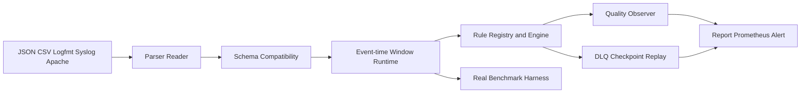

# MoonBit 流式数据质量引擎结项设计

## 目标

将 `zmjknn/moon-stream-quality` 完成到 2026 年 8 月黑客松验收状态：围绕申报书承诺补齐可用于生产流处理的事件时间窗口、流健康监控、健壮解析、Schema 演进、失败恢复和真实基准能力；保持 MoonBit 为主要实现语言，将有效 `.mbt` 规模提升到约 8,000 行，并用可复现测试、CI 和发布流程证明质量。

## 背景与现状

当前仓库已经包含 core、schema、rules、parser、engine、pipeline、report、sink、benchmark 和 CLI 包，能运行 29 个测试。排除 `_build` 生成物后有 4,943 行 `.mbt`，非测试实现 4,382 行，已经达到 4k 规模下限，但 README 与申报书的旧统计数字、比赛名称和 benchmark 吞吐率仍不适合验收使用。

申报书的核心承诺是多格式实时解析、动态 Schema、10 类质量规则、乱序/水位线、窗口聚合、统计漂移、双流 Join、DLQ、报告、Prometheus 和告警。本次设计优先补齐这些能力之间目前缺少的运行时连接，不改变项目的轻量、零外部依赖和 Wasm 优先定位。

## 方案选择

### 方案 A：只补文档、CI 和测试

改动风险最低，但不能证明新增实际应用价值，无法解释 8 月黑客松结项阶段的功能增量，放弃。

### 方案 B：事件时间运行时 + 可观测质量 + 恢复与基准（采用）

在现有包边界内新增可复用的有界窗口运行时、质量观测器、解析/Schema 防御层、checkpoint/DLQ 重放和真实 benchmark。每个模块都以公开 API、边界测试和报告输出闭环，能直接支持日志、IoT、交易流三类申报场景。预计新增约 2,500～3,000 行实现与测试，总规模约 7,500～8,500 行。

### 方案 C：增加配置 DSL 和持久化存储

功能上更大，但需要新的语法、文件格式和跨后端 I/O 约束，会引入不必要依赖与发布风险，不作为本次验收主线。

## 架构与数据流

1. Parser 将逐行输入变成 `StreamEvent`，保留错误位置和原始行摘要，非法输入不会导致整个批次崩溃。
2. Schema 层区分缺失、类型不兼容和可转换变化，应用默认值策略后才进入规则流水线。
3. Window runtime 按事件时间维护有界窗口，以 watermark 驱动关闭；超过乱序容忍度的事件按配置丢弃、旁路或接受并标记。
4. Engine 执行现有 10 类规则和新增流健康观察器，输出稳定的结果与统计计数。
5. 失败事件进入 DLQ，并可由 checkpoint 记录的游标重放；报告和 sink 消费同一批可审计指标。

## 新增模块边界

### `src/core/event_time.mbt`

提供 `LateEventPolicy`、`WindowAssignment`、`WatermarkTracker` 和 `EventTimeWindow`，负责事件时间、迟到分类、有界事件保存、窗口关闭和摘要快照；不负责质量规则或格式解析。

### `src/schema/compatibility.mbt`

提供 `SchemaCompatibility`、`CompatibilityMode` 和 `SchemaDiff`，对字段缺失、类型变化、可选字段和默认值进行确定性判断，与已有 `Schema`/`FieldDef` 配合。

### `src/parser/stream_reader.mbt`

提供分块输入的行边界处理、带引号 CSV 字段解析和 JSONL 逐行结果封装，保证跨 chunk 的引号/转义状态不会丢失；错误结果包含行号和列号。

### `src/rules/health.mbt` 与 `src/rules/quantile.mbt`

提供 `StreamHealthMonitor`、`HealthSnapshot`、`HealthStatus` 和有界分位数估计。监控事件数、通过数、失败数、空值/重复数、延迟 p50/p95/p99、窗口 EPS、burst/starvation 状态和质量趋势；内部采用固定容量结构，避免无界数组。

### `src/pipeline/checkpoint.mbt` 与 `src/pipeline/replay.mbt`

提供确定性 `PipelineCheckpoint`、`ReplayPlan` 和重放结果，记录 source/partition/offset、事件数、失败数、watermark 与 DLQ 游标；只做内存序列化/反序列化，不引入文件或网络依赖。

### `src/benchmark/realistic.mbt` 与 `docs/benchmarks/`

提供金融、传感器和访问日志三种固定种子 workload，使用 MoonBit benchmark 运行真实测量，记录 target、release/debug、工具链版本、事件数量、均值/中位数/分位数和质量结果。任何吞吐数字都来自运行输出，不再硬编码。

## 错误处理

- 解析错误返回结构化 `ParseIssue`，继续处理后续输入。
- Schema 不兼容事件产生失败结果并可进入 DLQ；兼容但需默认值的事件保留修正计数。
- 窗口容量、窗口时长、watermark 乱序容忍度、DLQ 容量和重试次数小于零时使用明确的安全默认值或返回失败结果。
- 空批次、全失败批次和没有数值样本时报告返回零分母安全结果，不产生 NaN/Inf。
- 所有新增状态机都提供 reset/clear 或快照恢复入口，避免测试之间共享状态。

## 测试策略

- 每个新增公开函数先添加一个会失败的黑盒测试，再实现最小行为。
- 覆盖空输入、单元素、边界等于、边界外一位、重复、乱序、极晚事件、满容量、零容量、非法转义、引号换行、Schema 演进、DLQ 达到上限、重放幂等和跨后端稳定性。
- 保留现有 29 个测试，新增目标至少 70 个测试用例；测试断言优先使用稳定值，调试结构使用 `Debug`/`debug_inspect`。
- 本地门禁：`moon fmt --check`、`moon info`、`moon check --deny-warn --target all`、`moon test --deny-warn --target all`、CLI native 运行和 `moon bench`。
- CI 三平台执行 check/test/format/info diff，并保留手动 Mooncakes 发布 workflow；CI 不保存或读取本地账号缓存。

## 文档与发布

- README 统一使用“8 月黑客松”定位，展示准确源码统计命令、运行示例、真实 benchmark 表和验收清单。
- 根目录 LICENSE 保持 Apache-2.0；新增代码与测试数据均为本项目原创合成数据，无未知上游复制内容。
- `moon.mod` 保持 `zmjknn/moon-stream-quality` namespace 与 GitHub 仓库 owner 一致，版本提升到 `0.2.0`。
- 推送前只通过 GitHub API/CLI 当前授权状态确认登录账号，不读取历史账号缓存；通过 `git remote show origin` 确认默认分支。
- Mooncakes 发布前核对当前 `moon login` 身份与 module namespace，先完成本地 check/test，再执行一次发布并验证包查询结果。

## 非目标

- 不新增数据库、网络客户端、外部消息队列或异步运行时依赖。
- 不把 `_build`、缓存、生成 driver 或 benchmark 临时输出计入源码规模。
- 不把注释、重复 wrapper 或无意义复制作为规模扩展。
